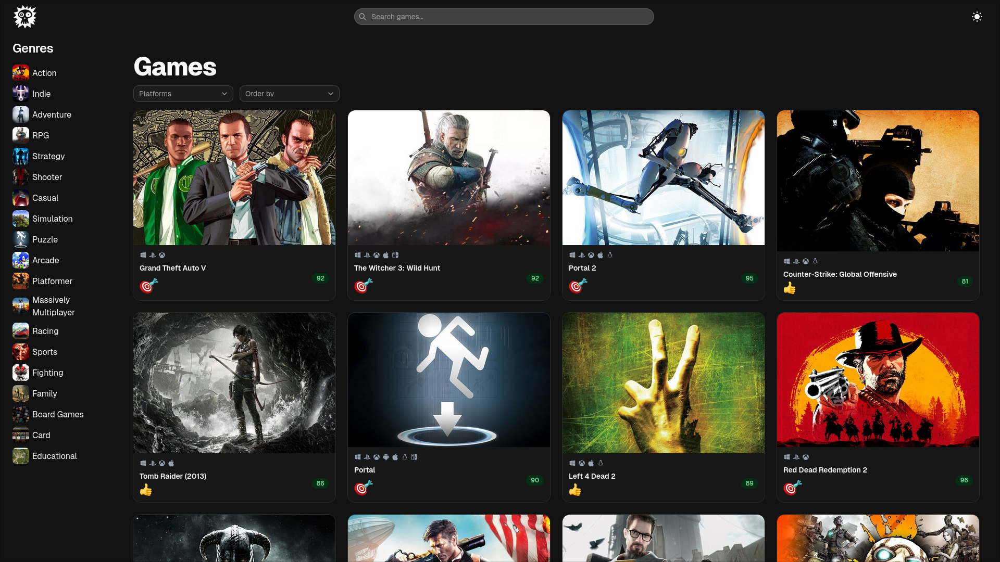

# Game-hub
      


A modern game discovery web app for browsing, searching, and filtering video games with a clean responsive UI powered by the RAWG API.

## Features
- Browse trending and popular games
- Search games by title
- Filter by genre, platform, and sort order
- View game ratings and critic scores
- Responsive layout for desktop and mobile
- Dark/light theme toggle
- Loading skeletons for smoother UX
- Error handling for failed requests

## Tech Stack
- React 19
- TypeScript
- Axios
- TailwindCSS 4
- Shadcn UI
- Iconify
- Vite
- pnpm

## Screenshot



## Live Demo
[Game-hub](https://game-hub-houssam.vercel.app/)


## Installation
```bash
# Clone the repo
git clone https://github.com/houssamouhra/game-hub.git
cd game-hub

# Install dependencies
pnpm install

# Start development server
pnpm dev
```

## License
[MIT License](./LICENSE)
